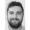
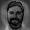
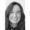
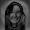

# Reconnaissance faciale par Analyse en Composantes Principales : Livrable 2

## Introduction

Afin de visualiser la mise en page de ce document, il est conseillé de l'ouvrir avec un logiciel qui interprète le markdown.

## Description

### Stockage des images

Afin de contenir les informations des images, nous avons construit une map pour stocker le nom, le prénom et l'émotion de la personne sur l'image. Nous avons ensuite stocké toutes ces informations dans un fichier CSV afin de les réutiliser facilement.

### Taille des images de la base de données

En constatant le temps d'exécution du programme et le grand nombre de données à traiter, nous avons décidé de réduire les images à 30 x 30 pixels.
Ainsi le temps d'exécution du programme n'est plus que de quelques secondes et les visages restent reconnaissables pour l'utilisateur.

### Image moyenne 

Lors de l'exécution du code, l'image moyenne est calculée puis générée. Elle est enregistrée dans le dossier "images_resultats" du projet.

### Images centrées

Grâce à l'image moyenne, nous avons pu obtenir les images centrées. En voici quelques exemples :

<p align="center">


</p>
<p align="center">


</p>

### Matrice des eigenfaces

Grâce à la librairie "smile", nous avons pu faire les calculs pour l'ACP et ainsi obtenir la matrice des eigenfaces.
Nous avons importé la librairie "opencsv" afin de stocker cette dernière dans le fichier CSV, "matriceFinale.csv".
Ainsi nous pouvons la réutiliser pour éviter de refaire tous les calculs.

### Projection et résultats

Une fois la matrice des eigenfaces créée, l'utilisateur peut rentrer le nom de l'image qu'il souhaite tester. Le programme projette, l'image et sélectionne l'image la plus ressemblante, c'est à dire l'image où l'erreur est la plus faible. Nous avons fixé un seuil d'erreur à 0,2, au dessus du quel le programme considère que le visage n'appartient pas à la même personne.
<br/>
Le programme affiche donc le nom et prénom de la personne de la photo test. Sinon, le programme informe l'utilisateur qu'il n'a pas trouvé de visage correspondant.

## Manuel d'utilisation

Pour lancer le programme il faut ouvrir un terminal à la racine du projet et saisir la commande suivante.

``` bash
java -jar ./reconnaissanceFaciale.jar
```

Le programme demande à l'utilisateur de saisir le nom d'une image de test parmi les visages qui font partis de la base d'apprentissage :
- T_004.jpg
- T_008.jpg
- T_012.jpg
- T_016.jpg
- T_020.jpg
- T_024.jpg
- T_028.jpg
- T_032.jpg
- T_036.jpg
- T_043.jpg
- T_050.jpg
- T_057.jpg
- T_064.jpg
- T_071.jpg
  
Nous avons également ajouté des images test dont les personnes ne font pas parties de la base d'apprentissage :
- T_072.jpg
- T_073.jpg
- T_074.jpg

Le programme ne donne pas le bon résultat pour 3 images, notre modéle a donc 82% de réussite.
